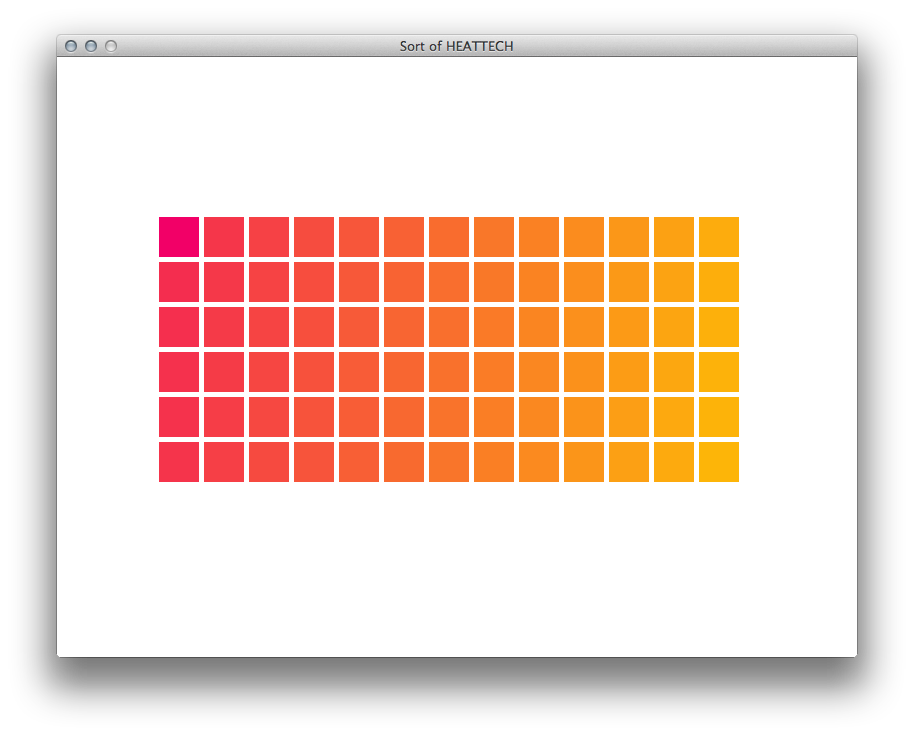
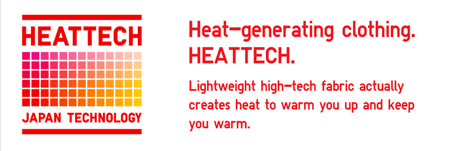
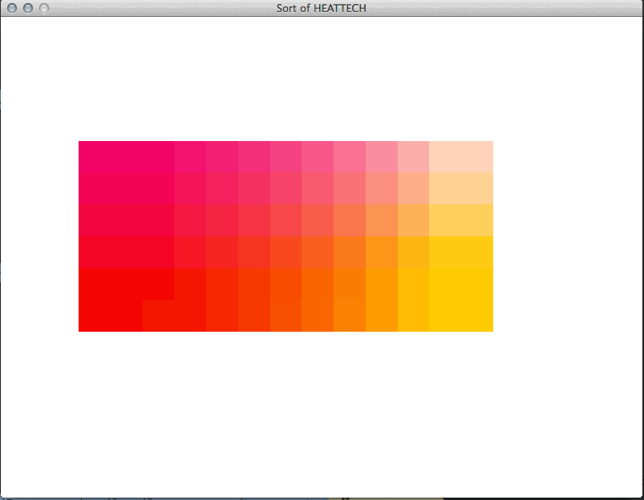

# Sort of HEATTECH

My (somewhat) fruitful attempt using linear interpolation to duplicate
the square pattern found in UNIQLO's HEATTECH advertising. You'll notice
that the pattern doesn't quite match up (but it's somewhat close!).

Head on over to the [LOVE](http://love2d.org) website, grab a copy for
your platform, and give it a whirl!

 
 

Use the up and down
arrows to tool with the spacing between squares

 
